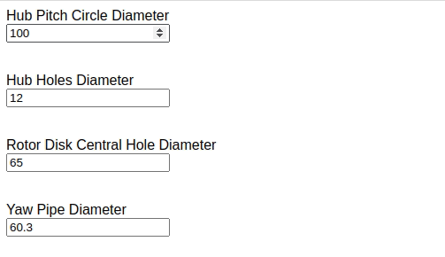
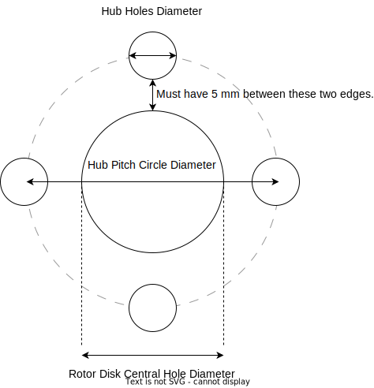
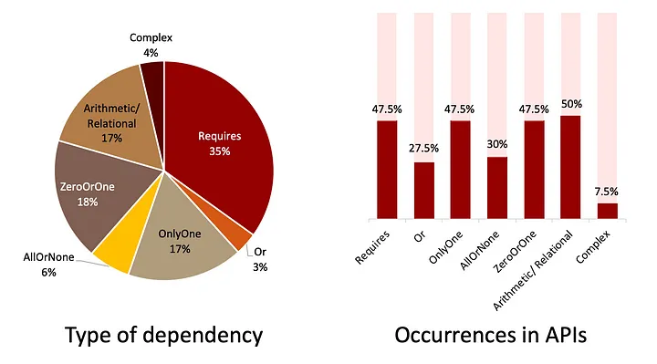

# JSON Schema Interproperty Expressions

**Motivation:** [JSON Schema](https://json-schema.org/) provides a comprehensive [vocabulary](https://json-schema.org/learn/glossary.html#vocabulary) for property-level constraints, but lacks a vocabulary for [relational constraints](https://en.wikipedia.org/wiki/Relational_operator) *between* properties.

Simple use-cases for interproperty expressions are:

* ensuring an end date is after a start date
  
  <details>
    <summary>expand schema</summary>

    ```js
    {
      "type": "object",
      "properties": {
        "startDate": {
          "type": "string",
          "format": "date",
          "title": "Start Date"
        },
        "endDate": {
          "type": "string",
          "format": "date",
          "title": "End Date"
        }
      },
      "interpropertyExpressions": [
        {
          // Equivalent infix expression:
          // {startDate} < {endDate}
          "expression": "{startDate} {endDate} <",
          "type": "postfix",
          "message": "End date must be after start date.",
          "properties": ["startDate", "endDate"]
        }
      ]
    }
    ```
  </details>

* ensuring a confirmation password is the same as a password

  <details>
    <summary>expand schema</summary>

    ```js
    {
      "type": "object",
      "properties": {
        "password": {
          "type": "string",
          "title": "Password"
        },
        "confirmationPassword": {
          "type": "string",
          "title": "Confirm Password"
        }
      },
      "interpropertyExpressions": [
        {
          // Equivalent infix expression:
          // {password} = {confirmationPassword}
          "expression": "{password} {confirmationPassword} =",
          "type": "postfix",
          "message": "Confirmation password must match password.",
          "properties": ["password", "confirmationPassword"]
        }
      ]
    }
    ```
  </details>

This repository features an advanced [CAD](https://en.wikipedia.org/wiki/Computer-aided_design) example where the user inputs values defining the [hub](https://en.wikipedia.org/wiki/Wheel#Hub) and [rotor](https://en.wikipedia.org/wiki/Rotor_(electric)) for an [electric generator](https://en.wikipedia.org/wiki/Electric_generator).

To run the demo, open [`index.html`](./index.html) in your web browser of choice.

The demo uses a [postfix expression](https://en.wikipedia.org/wiki/Reverse_Polish_notation), as it's easy to evaluate using a [stack](https://en.wikipedia.org/wiki/Stack_(abstract_data_type)), and doesn't require the use of [`eval`](https://developer.mozilla.org/en-US/docs/Web/JavaScript/Reference/Global_Objects/eval) which poses security risks.

(⚠️ *Edge cases are not tested.*)

The below **GIF** demonstrates validating the complex relationship between three related inputs explained by the **Diagram**.

The user can adjust any of the three inputs when the constraint is violated.

|GIF|Diagram|
|---|---|
|||

[`diagram.drawio`](./diagram.drawio) may be edited at https://app.diagrams.net/

## interpropertyExpressions keyword

The `interpropertyExpressions` keyword **MUST** be included alongside the schema of an object.

For example:

```js
{
  "type": "object",
  "properties": {
    // ...
  },
  "interpropertyExpressions": [
    // ...
  ]
}
```

`interpropertyExpressions` includes an array of `InterpropertyExpression` objects whose schema is defined by the following [meta-schema](https://json-schema.org/learn/glossary.html#meta-schema):

```js
{
  "type": "object",
  "title": "InterpropertyExpression object",
  "properties": {
    "expression": {
      "type": "string",
      "description": "Relational expression between two or more properties where true means valid."
    },
    "type": {
      "type": "string",
      "description": "Type of expression. Implementing libraries may only support one or more types.",
      "enum": ["postfix", "infix", "prefix"]
    },
    "message": {
      "type": "string",
      "description": "Message to display if expression is not valid."
    },
    "properties": {
      "type": "array",
      "description": "Array of property names included in expression.",
      "items": {
        "type": "string",
        "description": "Property name with dot notation for nested properties."
      }
    }
  }
}
```

### Postfix Expression

An expression where [operators](https://en.wikipedia.org/wiki/Operation_(mathematics)) follow [operands](https://en.wikipedia.org/wiki/Operand) meeting the following criteria:

* Operators and operands are delimited by white-space.

  <details>
    <summary>Rationale</summary>
    Avoids ambiguity in parsing expressions where operands contain potential operators.

    For example, consider the following expression comparing two dates:
    ```
    2022-12-25 2022-12-26 <
    ```

    Then the following expression subtracting two numbers:
    ```
    2022 12 -
    ```

    Other examples include timestamps (e.g. `2018-11-13T20:20:39+00:00`) and addition (i.e. `+`).
  </details>

* Operators have a fixed number of operands.

  <details>
    <summary>Rationale</summary>
    If every operator has a fixed number of operands, then parentheses are not needed.
  </details>

* Operators are one symbol.
  <details>
    <summary>Rationale</summary>

    Avoids a [lookahead](https://en.wikipedia.org/wiki/Parsing#Lookahead) when parsing potentially ambiguous operators such as `<` (if `<=` is also an operator).
  </details>

* Properties are surround by curly-braces (i.e. `{` and `}`) with dot notation for nested properties.

The following table documents supported [**arithmetic** operators](https://en.wikipedia.org/wiki/Arithmetic).

|Operator|Name|Operands|
|:------:|----|:------:|
|`+`|[Addition](https://en.wikipedia.org/wiki/Addition)|2|
|`-`|[Subtraction](https://en.wikipedia.org/wiki/Subtraction)|2|
|`*`|[Multiplication](https://en.wikipedia.org/wiki/Multiplication)|2|
|`/`|[Division](https://en.wikipedia.org/wiki/Division_(mathematics))|2|
|`^`|[Exponentiation](https://en.wikipedia.org/wiki/Exponentiation)|2|
|`%`|[Modulo](https://en.wikipedia.org/wiki/Modulo)|2|

The following table documents supported [**relational** operators](https://en.wikipedia.org/wiki/Relational_operator).

|Operator|Name|Operands|
|:------:|----|:------:|
|`<`|Less than|2|
|`≤`|Less than or equal to|2|
|`>`|Greater than|2|
|`≥`|Greater than or equal to|2|
|`=`|Equal to|2|
|`≠`|Not equal to|2|

## Related Work

According to "*[A Catalogue of Inter-parameter Dependencies in RESTful Web APIs](https://www.researchgate.net/publication/336816181_A_Catalogue_of_Inter-parameter_Dependencies_in_RESTful_Web_APIs)*", "Arithmetic / Relational" dependencies between parameters are the most recurrent across the APIs examined. Additionally, 17% of the inter-parameter dependencies
found are of this type.

[](https://medium.com/isa-group/inter-parameter-dependencies-in-rest-apis-4664e901c124)
